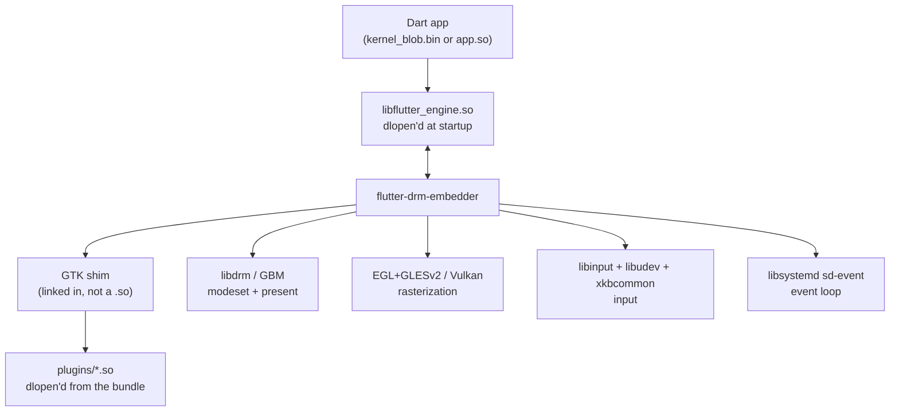

# flutter-drm-embedder

A custom Flutter engine embedder for Linux that renders directly to DRM/KMS — no X11, no Wayland,
no compositor. It boots to a console and draws straight to the display controller.

Forked from [flutter-pi](https://github.com/ardera/flutter-pi). The main addition is a GTK-style
plugin bridge, which lets unmodified Flutter *Linux desktop* plugins compile and register against
this embedder instead of against GTK.

## What an embedder is

The Flutter engine (`libflutter_engine.so`) is platform-agnostic. It knows how to run Dart, lay out
widgets, and rasterize — but it does not know how to open a window, read a touchscreen, or put a
frame on screen. An embedder supplies those. It is the code that:

- loads the engine and hands it a renderer config (OpenGL or Vulkan callbacks),
- drives an event loop and tells the engine when to run tasks,
- feeds it input events and window metrics,
- takes rendered layers and presents them to the display,
- bridges platform channels between Dart and native code.

Everything below is how this embedder does those things, and which library it uses for each.

## Architecture



## How it interacts with each library

### The Flutter engine — `dlopen`, not linked

The engine is never linked at build time. It is resolved at runtime in
[flutter-drm-embedder.c:1159-1177](src/flutter-drm-embedder.c#L1159-L1177), trying in order:

1. an engine shipped inside the app bundle,
2. a configured `dlopen` name,
3. a fallback `dlopen` name (i.e. whatever the dynamic linker finds on the default search path).

Once loaded, the entire API is pulled through a single symbol —
`FlutterEngineGetProcAddresses` — into a `FlutterEngineProcTable`
([:1191-1210](src/flutter-drm-embedder.c#L1191-L1210)). Every engine call in the embedder goes
through that table rather than a direct symbol reference, so there is no link-time dependency on any
particular engine build.

This is what makes the runtime mode a *runtime* property. Debug uses a JIT engine plus
`kernel_blob.bin`; profile and release use an AOT engine plus `app.so`. The embedder checks the two
agree via `RunsAOTCompiledDartCode()` and refuses to start on a mismatch
([:2780-2795](src/flutter-drm-embedder.c#L2780-L2795)). One binary runs all three modes — pick with
`--release` / `--profile`, default debug.

### libdrm + GBM — modesetting and scanout

[modesetting.c](src/modesetting.c) opens the DRM device and requests
`DRM_CLIENT_CAP_UNIVERSAL_PLANES` and `DRM_CLIENT_CAP_ATOMIC`
([:1054-1077](src/modesetting.c#L1054)). Atomic modesetting is used when the driver supports it,
with a legacy path as fallback.

GBM allocates the buffers the GPU renders into and the display controller scans out.
[egl_gbm_render_surface.c](src/egl_gbm_render_surface.c) prefers
`gbm_surface_create_with_modifiers` and falls back to plain `gbm_surface_create`
([:152-176](src/egl_gbm_render_surface.c#L152-L176)) — modifiers matter because they let the
allocator pick tiled or compressed layouts the scanout hardware can consume directly.

The compositor ([compositor_ng.c](src/compositor_ng.c)) implements the engine's two compositor
hooks: `create_backing_store_callback` and `present_layers_callback`
([:171-173](src/compositor_ng.c#L171-L173)). Flutter hands over a list of layers; the compositor maps
them onto DRM planes and commits. Layers that can go on a hardware plane skip the GPU entirely.

### EGL + GLESv2, or Vulkan

Both backends are optional at build time (`ENABLE_OPENGL`, `ENABLE_VULKAN`) and selected at runtime.
The renderer config is filled in as either `kOpenGL` or `kVulkan`
([flutter-drm-embedder.c:1293-1320](src/flutter-drm-embedder.c#L1293-L1320)) and handed to the
engine, which then calls back for context management and buffer swaps.

GL procs are resolved with `dlsym(RTLD_DEFAULT, ...)`
([gl_renderer.c:73](src/gl_renderer.c#L73)) rather than through a loader like GLEW or epoxy.

### libinput + libudev + xkbcommon — input

[user_input.c](src/user_input.c) creates a libinput context in udev mode
(`libinput_udev_create_context`, [:306](src/user_input.c#L306)), so devices are discovered and
hotplugged through udev rather than by opening `/dev/input/*` directly. Keyboard scancodes go
through xkbcommon for keymap translation into keysyms
([:692-808](src/user_input.c#L692)). `libseat` is used when available to acquire the DRM master and
input devices without running as root.

### libsystemd (sd-event) — the event loop

[event_loop.c](src/event_loop.c) is built on `sd_event`, not a hand-rolled `epoll` loop. Input fds,
DRM events, and timers all become sd-event sources.

The engine is given a **custom platform task runner only** —
`custom_task_runners.render_task_runner` is explicitly `NULL`
([flutter-drm-embedder.c:1337-1351](src/flutter-drm-embedder.c#L1337-L1351)). So platform tasks are
posted into the sd-event loop and run on the main thread, while the engine spawns and owns its own
raster thread. This is why plugin code that touches the platform side must be posted with
`flutter_drm_embedder_post_platform_task()` rather than called from wherever.

### GLib / GObject / GIO — the GTK shim

Flutter's Linux desktop plugin API is GObject-based: `FlValue`, `FlMethodChannel`,
`FlPluginRegistrar`, and friends, normally provided by `libflutter_linux_gtk.so`. This fork
reimplements that surface on top of the embedder in
[src/flutter_linux_gtk_shim/](src/flutter_linux_gtk_shim/), so a plugin written for Flutter Linux
compiles unchanged.

It needs GLib, GObject and GIO but **not** GTK itself — no windowing toolkit is involved. The three
GLib packages are technically probed as optional but the build hard-errors without them, since the
shim is always compiled in.

Because plugins expect to run inside a GLib main context, the shim pumps GLib's default context on
the platform thread ([fl_glib_dispatch.c](src/flutter_linux_gtk_shim/fl_glib_dispatch.c)).

The shim is **linked into the executable**, not shipped as a shared library. Plugins leave the
`fl_*` symbols undefined and resolve them from the executable's dynamic symbol table at `dlopen`
time, which is why the binary is linked with `--export-dynamic`.

## Plugin loading

At startup the embedder scans `<bundle>/plugins/` for `*.so`
([plugin_loader.c:160-230](src/plugin_loader.c#L160-L230)). For each file it:

1. strips the `lib` prefix and `.so` suffix,
2. appends `_register_with_registrar` to get a symbol name,
3. `dlopen`s the library with `RTLD_NOW | RTLD_GLOBAL`,
4. resolves that symbol and calls it with a fresh `FlPluginRegistrar`.

So `libmy_plugin.so` must export `my_plugin_register_with_registrar` — the same convention
`flutter build linux` already generates.

Platform channels are bridged through the embedder's plugin registry, so shim-registered channels
and the embedder's own built-in plugins share one message dispatch path.

## External textures

Plugins that produce frames (video decoders, camera feeds) register with
[texture_registry.c](src/texture_registry.c), which wires them to the engine's external texture
mechanism via `FlutterOpenGLTexture`. The engine pulls a frame when it composites; the plugin
signals new frames rather than pushing pixels through a platform channel.

## Build

```bash
cmake -B build -S . -DCMAKE_BUILD_TYPE=Release -GNinja
cmake --build build
```

Produces a single executable, `flutter-drm-embedder`. There is no separate shim library to install.

Required: `libdrm`, `gbm`, `libsystemd`, `libinput`, `xkbcommon`, `libudev`, `glib-2.0`,
`gobject-2.0`, `gio-2.0`.

Notable options:

| Option | Default | Effect |
| - | - | - |
| `ENABLE_OPENGL` | ON | EGL/GLES render backend |
| `ENABLE_VULKAN` | OFF | Vulkan render backend |
| `ENABLE_SESSION_SWITCHING` | ON | libseat session/VT switching |
| `ENABLE_TESTS` | OFF | Build the unit tests (requires `third_party/Unity`) |
| `LTO` | ON | Link-time optimization (Release/RelWithDebInfo only) |
| `USE_LEGACY_KMS` | OFF | Force legacy KMS instead of atomic |

No application plugins are built into the embedder. Video, audio, and everything else ship as
shared libraries in the app bundle — see [Plugin loading](#plugin-loading).

## Running

```bash
flutter-drm-embedder [--release|--profile] /path/to/bundle
```

The bundle needs `icudtl.dat`, the Flutter assets, and either `kernel_blob.bin` (debug) or `app.so`
(profile/release). A matching `libflutter_engine.so` must be loadable — see the engine section
above for the resolution order.

## Supported platforms

Needs KMS and DRI — kernel modesetting with working 3D acceleration. Architecture must be ARMv7,
ARMv8, x86, or x86-64.

Known working: Pi 2, 3, 4 (including 512MB models) and Pi Zero 2 (W). Will not work on a Pi 1 or the
original Pi Zero.
